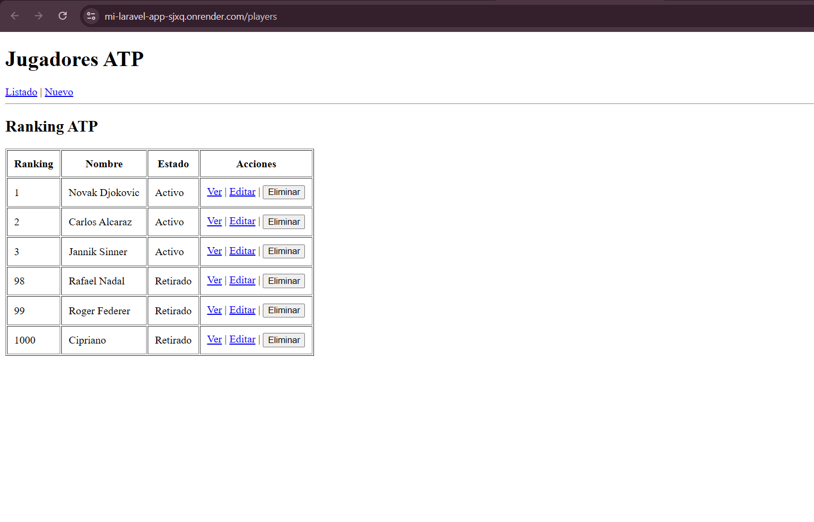

# Laravel Dockerized: Local, Dev & Production

Readme del proyecto Despliegue para funcionar en tres entornos distintos: **Local (Híbrido)**, **Desarrollo (Full Docker)** y **Producción (Render)**.

## 🌐 Despliegue en Producción
La aplicación está desplegada y funcionando en Render:
**[https://mi-laravel-app-sjxq.onrender.com/players]**

---

## Requisitos Previos
- Docker Desktop instalado y corriendo.
- PHP y Composer (solo para el entorno Local Híbrido).
- Git.

## 1. Entorno LOCAL (Híbrido)
En este entorno, **PHP/Laravel** se ejecuta en tu máquina host, mientras que **PostgreSQL** se ejecuta en un contenedor Docker.

### Pasos para arrancar:
1. Copia el archivo de entorno:
cp .env.example .env

Configura las variables de base de datos en el .env para conectar con Docker:

Ini, TOML

DB_CONNECTION=pgsql
DB_HOST=127.0.0.1
DB_PORT=5432
DB_DATABASE=laravel
DB_USERNAME=user
DB_PASSWORD=1234

Levanta la base de datos:
docker-compose -f docker-compose.local.yml up -d

Instala dependencias y corre migraciones:
composer install
php artisan migrate

Inicia el servidor:
php artisan serve

Visita: http://localhost:8000

## 2. Entorno DEV (Full Docker)
En este entorno, Toda la aplicación (Laravel + PostgreSQL) corre dentro de contenedores. Incluye automatización de migraciones y seeders al arrancar.

Pasos para arrancar:

Ejecuta el comando de construcción y arranque:

docker-compose -f docker-compose.dev.yml up --build

Espera a que termine el proceso. El sistema automáticamente:

Esperará a que la BD esté lista.

Ejecutará php artisan migrate --force.

Ejecutará php artisan db:seed --force (cargando datos de prueba).

Visita: http://localhost:8000

Nota: Para detener este entorno usa: docker-compose -f docker-compose.dev.yml down

## 3. Entorno PRODUCCIÓN (Render)

Configuración en Render:
Se ha desplegado como un Web Service conectado a una PostgreSQL Database interna de Render.

Variables de Entorno configuradas en Render:

APP_ENV: production

APP_KEY: (Generada o copiada del local)

APP_DEBUG: false

DB_CONNECTION: pgsql

DB_HOST: (Internal Hostname de la BD en Render)

DB_PORT: 5432

DB_DATABASE: (Nombre de la BD en Render)

DB_USERNAME: (Usuario de la BD en Render)

DB_PASSWORD: (Contraseña de la BD en Render)

Características del despliegue:
Entrypoint Inteligente: El script docker/entrypoint.sh ejecuta las migraciones automáticamente en cada despliegue, pero evita ejecutar los seeders si detecta APP_ENV=production para no duplicar datos o generar errores.

Estructura de archivos Docker
Dockerfile: Imagen base de PHP 8.2 con Apache y extensiones necesarias.

docker-compose.local.yml: Solo servicio de BD (Puerto 5432).

docker-compose.dev.yml: Servicios App (Puerto 8000) y BD.

docker/entrypoint.sh: Script de orquestación de arranque y migraciones.

## Captura de pantalla de la aplicación en Render:

